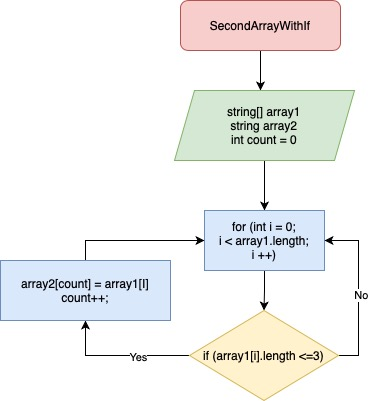

# -4

Описание алгоритма решения:

Сначало объявляется два массива: изначальный и вторый такой же длины. Потом метод, в котором цикл соразмерный длине массива, внутри цикла проверка условия ( <=3 ), если да элемент первого массива заносится в count элемент второго массива. Переменная count чтобы поочередно закидывать из первого массива во второй и чтобы потом не было пробелов. После присвоения увеличивается переменная count на 1 и возвращается к циклу for в котором i увеличивается на 1. И так проверяется до конца.

Графическое представление метода в папке Schem в двух файлах разных расширениях.

Реализация алгоритма по пути Task/Program.cs

string[] array1 = new string[5] {"123", "23", "hello", "world", "res"};
string[] array2 = new string[array1.Length];
void SecondArrayWithIF(string[] array1, string[] array2)
{
    int count = 0;
    for (int i = 0; i < array1.Length; i++)
    {
    if(array1[i].Length <= 3)
        {
        array2[count] = array1[i];
        count++;
        }
    }
}
void PrintArray(string[] array)
{
    for (int i = 0; i < array.Length; i++)
    {
        Console.Write($"{array[i]} ");
    }
    Console.WriteLine();
}
SecondArrayWithIF(array1, array2);
PrintArray(array2);